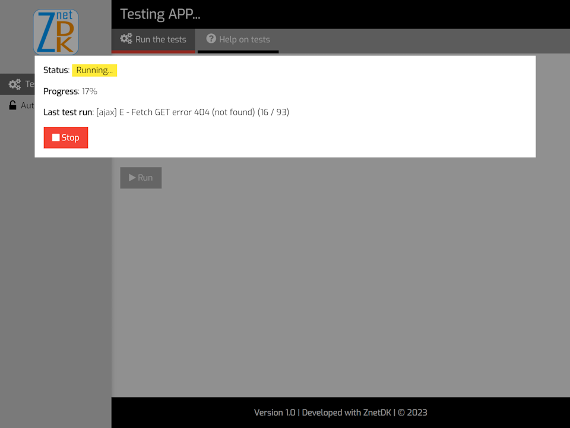

# Testing ZnetDK 4 Mobile
Application for testing **ZnetDK 4 Mobile**.

More than a hundred **unit** and **acceptance** test cases are executed by this application to validate the correct operation of **ZnetDK 4 Mobile**.
## Requirements
[ZnetDK 4 Mobile](https://github.com/pascal-martinez/znetdk4mobile) is installed.
> Go to the page [Getting Started](https://mobile.znetdk.fr/getting-started) to install ZnetDK 4 Mobile.

## Installation
1. Download the **ZIP archive** of the Testing App from this GitHub repository: [znetdk4mobile-test ZIP archive](https://github.com/pascal-martinez/znetdk4mobile-tests/archive/refs/heads/master.zip).
1. Add a subfolder named `tests` within the `INSTALL_DIR/applications/` folder of ZnetDK 4 Mobile.
1. Unzip the downloaded ZIP archive content within the new `INSTALL_DIR/applications/tests/` subfolder.
1. Create an empty MySQL database dedicated to the Testing App, named for example `z4m-tests-db` with the character set `utf8mb4_unicode_ci`.
1. Add the ZnetDK 4 Mobile [Security SQL tables](https://mobile.znetdk.fr/download#download-security-sql-tables) to the testing database by executing the script `znetdk-security.sql`.
1. Edit the `INSTALL_DIR/applications/tests/app/config.php` script and configure the testing database connection by changing the values of the PHP constants `CFG_SQL_HOST`, `CFG_SQL_APPL_DB`, `CFG_SQL_APPL_USR` and `CFG_SQL_APPL_PWD`. See [Getting Started - Connecting to a Database - Configuring the Application](https://mobile.znetdk.fr/getting-started#z4m-gs-connect-config) for more information.

## Running the tests
Once the installation is done, open your web browser and enter in the address bar, the URL of the Testing Application followed by the GET parameter `?appl=tests`.

> For example: `http://localhost/znetdk4mobile/index.php?appl=tests`

Next, click the **Run** button to start de tests.

